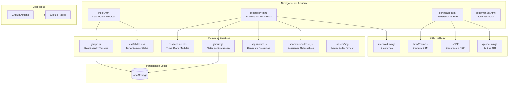
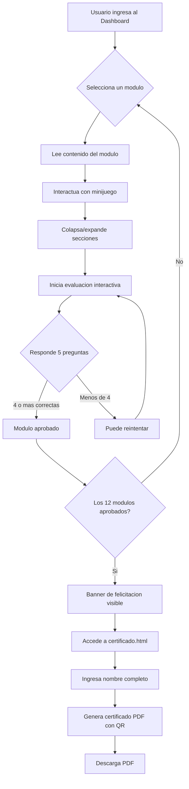
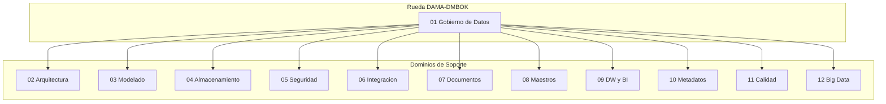
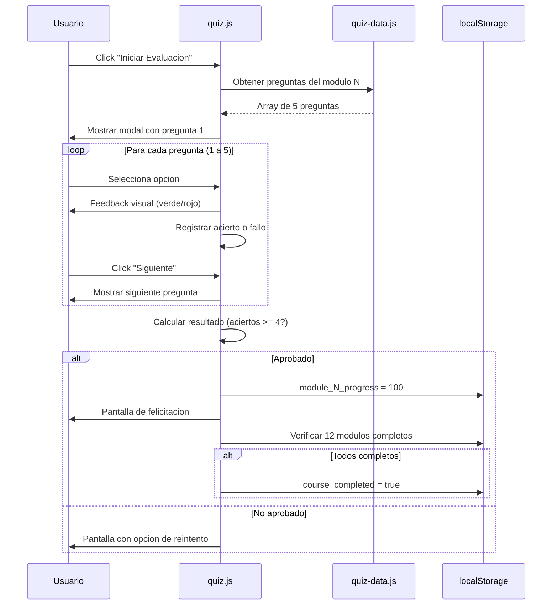
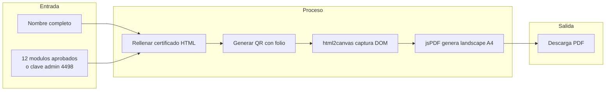
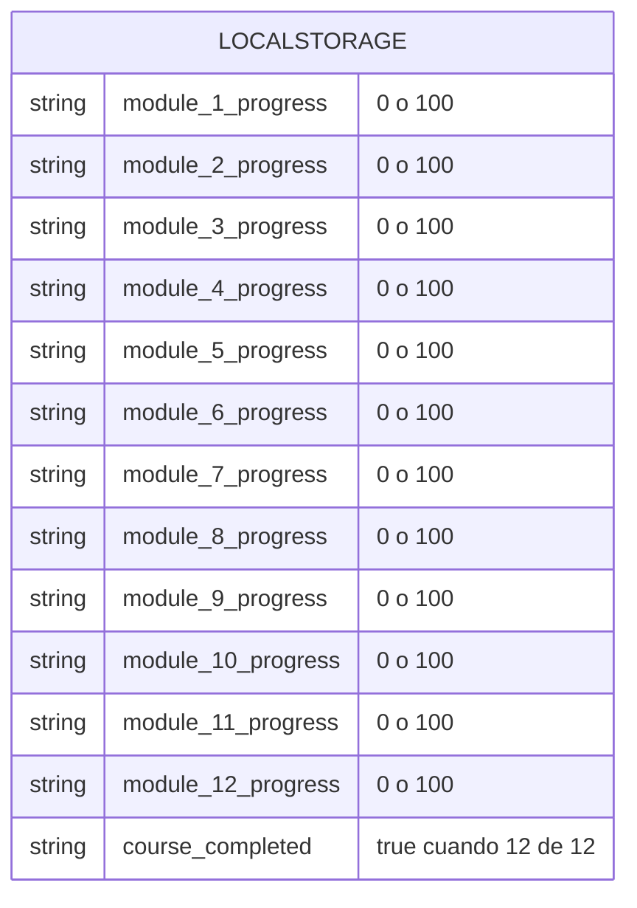
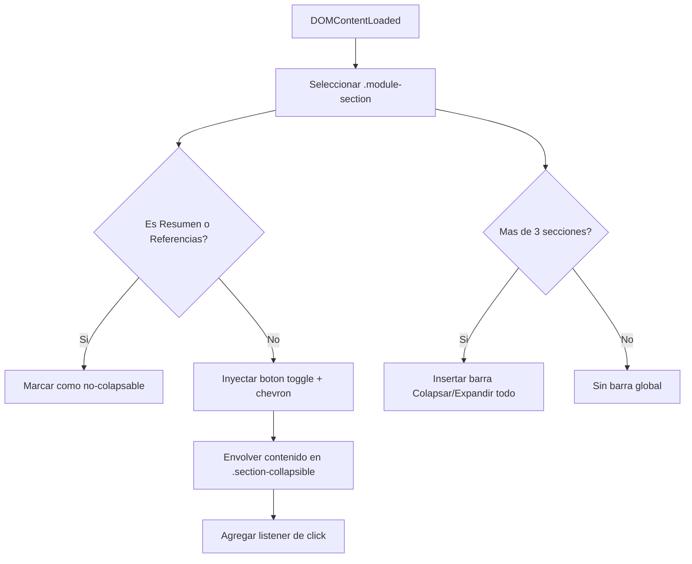
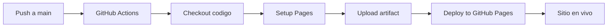
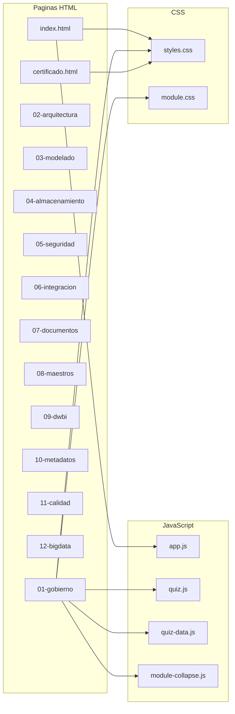

# GDCMJMC — Sistema Educativo de Gobierno de Datos

Sistema web educativo e interactivo para el aprendizaje de los **12 dominios de Gestión de Datos** del marco **DAMA-DMBOK**, contextualizado con principios de **Gobierno Corporativo** y la **Ley N.° 29733** de Protección de Datos Personales del Perú.

Desplegado en **GitHub Pages**: cada push a `main` publica automáticamente.

---

## Tabla de Contenidos

- [Descripcion General](#descripcion-general)
- [Arquitectura del Sistema](#arquitectura-del-sistema)
- [Stack Tecnologico](#stack-tecnologico)
- [Estructura de Archivos](#estructura-de-archivos)
- [Flujo de Usuario](#flujo-de-usuario)
- [Modulos Educativos](#modulos-educativos)
- [Sistema de Evaluacion](#sistema-de-evaluacion)
- [Generacion de Certificado](#generacion-de-certificado)
- [Persistencia de Datos](#persistencia-de-datos)
- [Sistema de Secciones Colapsables](#sistema-de-secciones-colapsables)
- [Despliegue CI/CD](#despliegue-cicd)
- [Diagrama de Componentes](#diagrama-de-componentes)
- [Modelo de Datos en LocalStorage](#modelo-de-datos-en-localstorage)
- [Secciones de Cada Modulo](#secciones-de-cada-modulo)
- [Frameworks y Estandares Referenciados](#frameworks-y-estandares-referenciados)
- [Autor](#autor)

---

## Descripcion General

El sistema permite a profesionales y estudiantes recorrer los 12 dominios del DAMA-DMBOK a traves de modulos interactivos que incluyen:

- Contenido teorico con secciones colapsables
- Relacion de cada dominio con DAMA-DMBOK, Gobierno Corporativo y la Ley 29733
- Minijuegos de decision situacional
- Evaluaciones de 5 preguntas por modulo
- Frameworks y estandares internacionales de referencia por modulo
- Generacion de certificado PDF con QR al completar los 12 modulos

---

## Arquitectura del Sistema



---

## Stack Tecnologico

| Capa | Tecnologia | Proposito |
|------|-----------|-----------|
| Markup | HTML5 | Estructura semantica |
| Estilos | CSS3 con variables custom | Tema dual (oscuro dashboard, claro modulos) |
| Logica | JavaScript ES6+ vanilla | Interactividad sin dependencias de build |
| Fuentes | Google Fonts (Outfit, Space Grotesk, Playfair Display) | Tipografia profesional |
| Diagramas | Mermaid.js (CDN) | Diagramas conceptuales en modulos |
| PDF | html2canvas + jsPDF (CDN) | Exportacion de certificado |
| QR | QRCode.js (CDN) | Codigo de verificacion en certificado |
| Persistencia | localStorage | Progreso del usuario |
| CI/CD | GitHub Actions | Despliegue automatico a GitHub Pages |

---

## Estructura de Archivos

```
GDCMJMC/
├── .github/
│   └── workflows/
│       └── static.yml          # CI/CD: deploy a GitHub Pages
├── assets/
│   └── img/
│       ├── faveicon.png        # Favicon del sitio
│       ├── logotipo.png        # Logo principal
│       ├── sello-v2.png        # Sello del certificado
│       └── sellomjmc.png       # Sello alternativo
├── css/
│   ├── styles.css              # Estilos globales (tema oscuro, loader, grid, quiz modal)
│   └── module.css              # Estilos de modulos (tema claro, secciones, colapsables)
├── docs/
│   └── manual.html             # Manual del sistema
├── js/
│   ├── app.js                  # Logica del dashboard: tarjetas, progreso, certificado
│   ├── quiz.js                 # Motor de evaluacion: modal, preguntas, calificacion
│   ├── quiz-data.js            # Banco de 60 preguntas (5 por modulo)
│   └── module-collapse.js      # Secciones colapsables + controles globales
├── modules/
│   ├── 01-gobierno.html        # Gobierno de Datos
│   ├── 02-arquitectura.html    # Arquitectura de Datos
│   ├── 03-modelado.html        # Modelado de Datos
│   ├── 04-almacenamiento.html  # Almacenamiento y Operaciones
│   ├── 05-seguridad.html       # Seguridad de Datos
│   ├── 06-integracion.html     # Integracion e Interoperabilidad
│   ├── 07-documentos.html      # Gestion de Documentos y Contenido
│   ├── 08-maestros.html        # Datos Maestros y de Referencia
│   ├── 09-dwbi.html            # Data Warehousing y BI
│   ├── 10-metadatos.html       # Gestion de Metadatos
│   ├── 11-calidad.html         # Calidad de Datos
│   └── 12-bigdata.html         # Big Data y Data Science
├── certificado.html            # Generador de certificado PDF con QR
├── index.html                  # Dashboard principal (punto de entrada)
└── README.md                   # Este archivo
```

---

## Flujo de Usuario



---

## Modulos Educativos

Los 12 modulos cubren el cuerpo completo de conocimiento del DAMA-DMBOK:



| N. | Modulo | Dominio DAMA-DMBOK | Archivo |
|----|--------|--------------------|---------|
| 01 | Gobierno de Datos | Data Governance | `01-gobierno.html` |
| 02 | Arquitectura de Datos | Data Architecture | `02-arquitectura.html` |
| 03 | Modelado de Datos | Data Modeling & Design | `03-modelado.html` |
| 04 | Almacenamiento de Datos | Data Storage & Operations | `04-almacenamiento.html` |
| 05 | Seguridad de Datos | Data Security | `05-seguridad.html` |
| 06 | Integracion de Datos | Data Integration & Interoperability | `06-integracion.html` |
| 07 | Documentos y Contenido | Document & Content Management | `07-documentos.html` |
| 08 | Datos Maestros | Reference & Master Data | `08-maestros.html` |
| 09 | DW y Business Intelligence | DW & BI Management | `09-dwbi.html` |
| 10 | Metadatos | Metadata Management | `10-metadatos.html` |
| 11 | Calidad de Datos | Data Quality | `11-calidad.html` |
| 12 | Big Data y Data Science | Big Data & Data Science | `12-bigdata.html` |

---

## Sistema de Evaluacion



**Reglas:**
- 5 preguntas de opcion multiple por modulo
- Aprobacion: 4 de 5 correctas (80%)
- Retroalimentacion inmediata por pregunta
- Posibilidad de reintento ilimitado

---

## Generacion de Certificado



**Datos del certificado:**
- Nombre del estudiante
- Folio unico (`GD-XXXXX`)
- Fecha y hora de emision
- Codigo QR de verificacion
- Firma: Miguel J. Mogrovejo Cardenas

---

## Persistencia de Datos

Toda la informacion del usuario se almacena en `localStorage` del navegador.



| Clave | Valores | Descripcion |
|-------|---------|-------------|
| `module_{1-12}_progress` | `"0"` o `"100"` | Progreso individual por modulo |
| `course_completed` | `"true"` | Flag de curso completo (12/12) |

El boton "Reiniciar Progreso" en el dashboard limpia todas las claves.

---

## Sistema de Secciones Colapsables

Cada modulo contiene entre 15 y 18 secciones. El script `module-collapse.js` las convierte automaticamente en paneles colapsables al cargar la pagina.



**Comportamiento:**
- Todas las secciones inician **abiertas**
- Click en el titulo colapsa/expande la seccion individual
- Chevron rota al colapsar (animacion CSS de 0.3s)
- Botones globales "Colapsar todo" / "Expandir todo" en la parte superior

---

## Despliegue CI/CD



El workflow `.github/workflows/static.yml` se ejecuta automaticamente en cada push a `main` o manualmente con `workflow_dispatch`.

---

## Diagrama de Componentes



---

## Secciones de Cada Modulo

Cada uno de los 12 modulos sigue una estructura estandarizada:

| Seccion | Icono | Descripcion |
|---------|-------|-------------|
| Descripcion del Modulo | 📋 | Introduccion al dominio DAMA |
| Relacion con DAMA-DMBOK | 📘 | Marco teorico del dominio |
| Relacion con Gobierno Corporativo | ⚖️ | Contexto de gobierno corporativo |
| Cumplimiento — Ley 29733 | 🔒 | Aplicacion de la ley peruana |
| Objetivos de Aprendizaje | 🎯 | 5 objetivos por modulo |
| Conceptos Clave | 🔑 | 5-7 definiciones fundamentales |
| Explicacion Tecnica Detallada | ⚙️ | Profundizacion tecnica |
| Ejemplos en Organizaciones | 🏢 | Casos Peru e internacionales |
| Buenas Practicas Internacionales | ✅ | 5 practicas recomendadas |
| Errores Comunes | ⚠️ | 5 antipatrones frecuentes |
| Casos de Uso Reales | 💼 | Empresas reales (BCP, SUNAT, UPS) |
| Herramientas y Tecnologias | 🛠️ | 5 herramientas relevantes |
| Frameworks y Estandares | 📚 | 4-6 frameworks de referencia |
| Ejercicio Practico | ✏️ | Actividad aplicada |
| Recomendaciones de Implementacion | 💡 | 5 consejos de implementacion |
| Resumen del Modulo | 📌 | Sintesis final |
| Minijuego Interactivo | 🎮 | Simulador de decision |
| Evaluacion (5 preguntas) | 📝 | Examen de aprobacion |

---

## Frameworks y Estandares Referenciados

Cada modulo incluye una seccion de frameworks relevantes a su tema:

| Modulo | Frameworks |
|--------|-----------|
| 01 Gobierno | DAMA-DMBOK, DCAM (EDM Council), CMMI-DMM, DGI Framework, COBIT 2019 |
| 02 Arquitectura | TOGAF, Zachman, ArchiMate 3.2, DAMA-DMBOK Cap. 4 |
| 03 Modelado | ER Model (Chen), IDEF1X, UML (OMG), Data Vault 2.0 |
| 04 Almacenamiento | ITIL v4, ISO 27001, AWS Well-Architected, Azure CAF |
| 05 Seguridad | ISO 27001/27002, NIST CSF, CIS Controls, PCI-DSS, OWASP |
| 06 Integracion | EAI Patterns (Hohpe & Woolf), ETL/ELT Patterns, Medallion, Apache |
| 07 Documentos | ISO 15489, Dublin Core, ECM (AIIM), MoReq2010 |
| 08 Maestros | MDM Framework (IBM), CDMP, Gartner MDM, ISO 8000 |
| 09 DW/BI | Kimball, Inmon CIF, Data Vault 2.0, TDWI Maturity Model |
| 10 Metadatos | ISO 11179, Dublin Core, CWM (OMG), W3C DCAT |
| 11 Calidad | ISO 8000, ISO 25012, DQAF (FMI), TDQM (MIT), Six Sigma, DAMA Cap. 13 |
| 12 Big Data | NIST Big Data, Lambda, Kappa, CRISP-DM, AI/ML Governance (OECD) |

El modulo 11 (Calidad) incluye ademas una **tabla comparativa de dimensiones de calidad** entre DAMA-DMBOK, ISO 25012, ISO 8000 y DQAF del FMI.

---

## Autor

**Miguel J. Mogrovejo Cardenas**
Sistema desarrollado con fines educativos basado en el marco DAMA-DMBOK, principios de Gobierno Corporativo y la Ley N.° 29733 de Proteccion de Datos Personales del Peru.

&copy; 2026 mjmc4498. Todos los derechos reservados.
